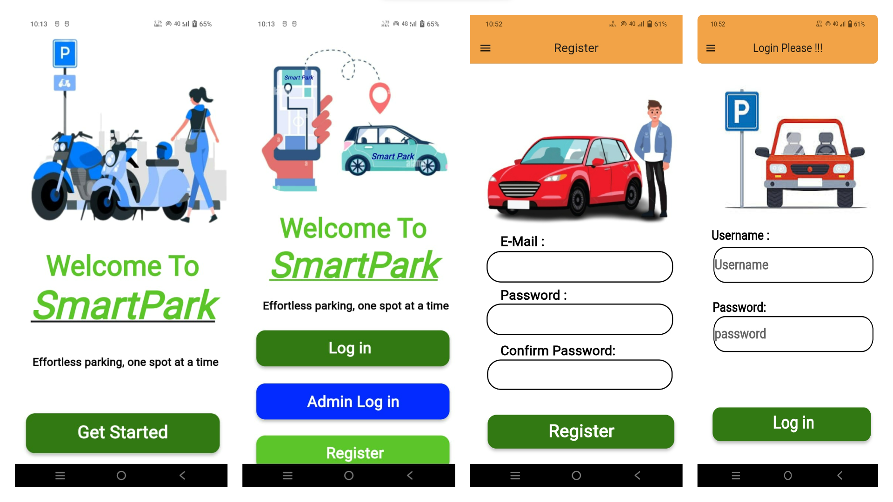
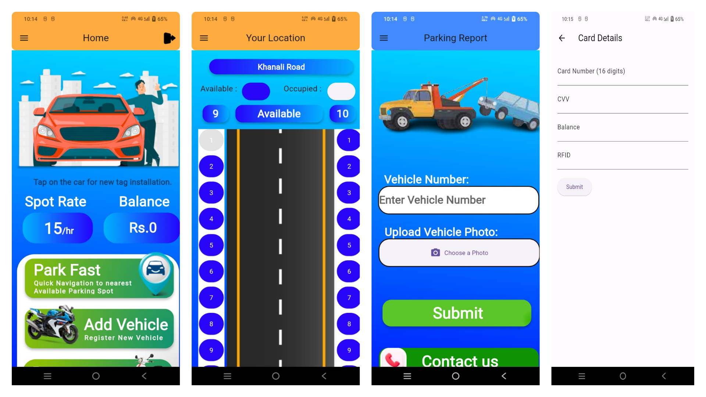
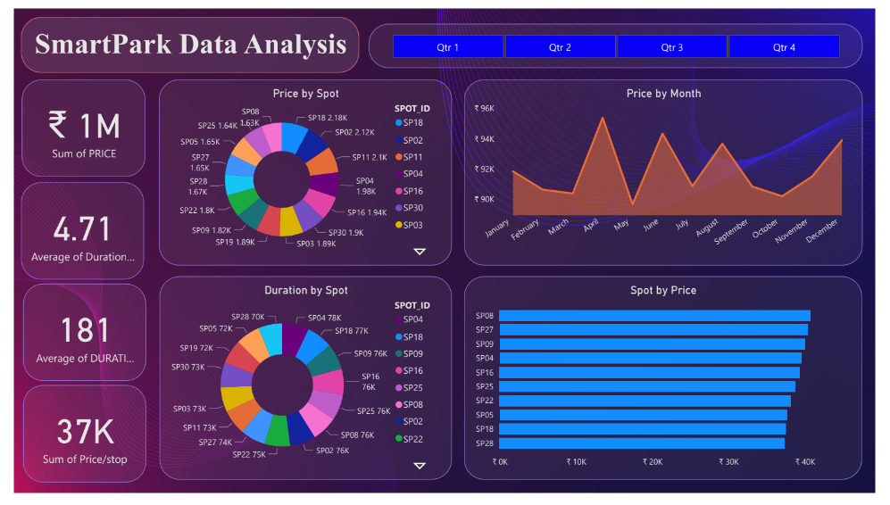

# Smart Park: Intelligent Parking System

## Overview

- Developed an Intelligent Parking System called 'Smart Park,' which uses Dart for app development and Python for the system's backend. In addition, I used Firebase for the database.

- Integrated RFID and ultrasonic sensors, calculated dynamic parking prices, and ensured secure user & admin authentication with Firebase.

- A push notification capability was implemented using the Twilio API service, and emails were sent to users' smartphones via the SendGrid mail service.

- Administrators can now access real-time data analytics with Power BI.

